<div align="center">

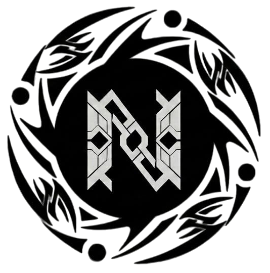

<br/>


<br/><br/>

**El arte de LATAM merece estar en el mundo**

[](https://ethmexico.org)
[](https://nextjs.org)
[](https://www.typescriptlang.org)
[](https://sepolia.etherscan.io)
[](https://anthropic.com)
[](./LICENSE)

<br/>

> **NEXUS** es una plataforma de arte digital impulsada por 4 agentes de IA que permite a creadores latinoamericanos desplegar colecciones NFT en Ethereum, subastarlas al mundo y recibir sus ganancias en **pesos mexicanos via SPEI** — todo en español, sin conocimientos técnicos.

<br/>

[](https://nexus-sigma-tan.vercel.app)
[](https://nexus-sigma-tan.vercel.app/chat)

</div>

---

## Vista Previa

### Landing Page

<div align="center">
  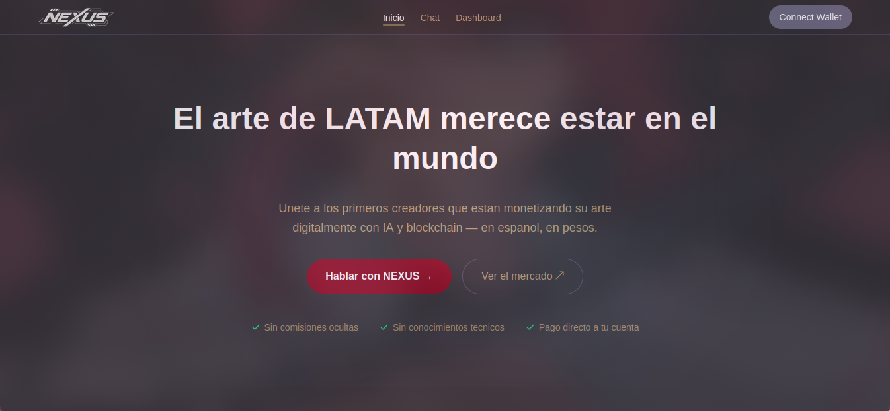
</div>

---

### Chat con el Agente NEXUS

> El creador habla en español. El agente coordina todo el proceso de despliegue y cobro.

<div align="center">
  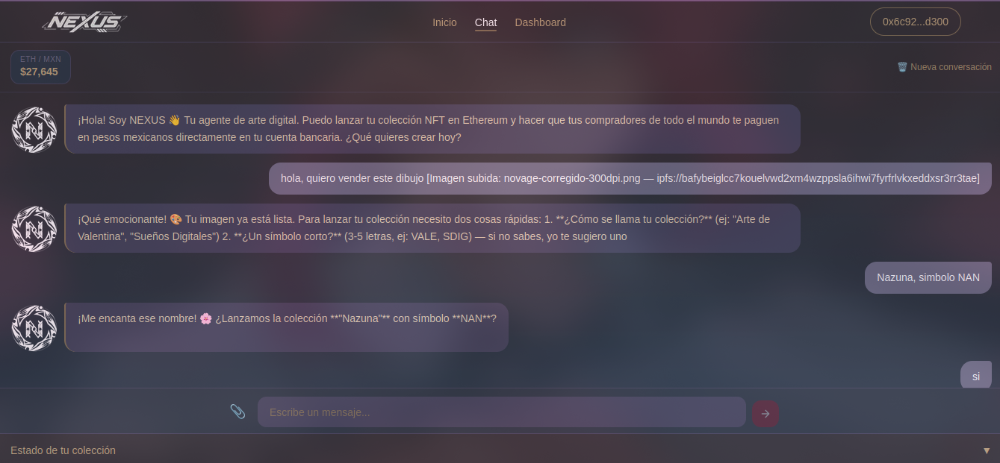
  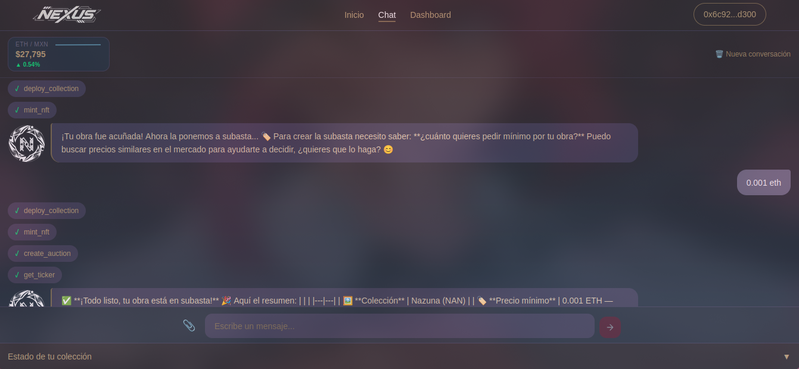
</div>

<div align="center">
  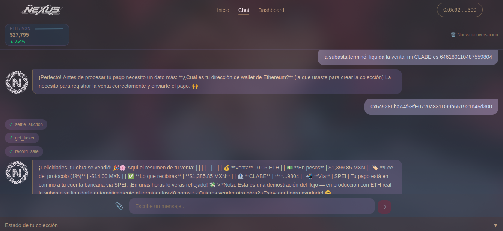
</div>

---

### Dashboard del Creador

> Visualiza tus colecciones, NFTs acunados y el estado del mercado en tiempo real.

<div align="center">
  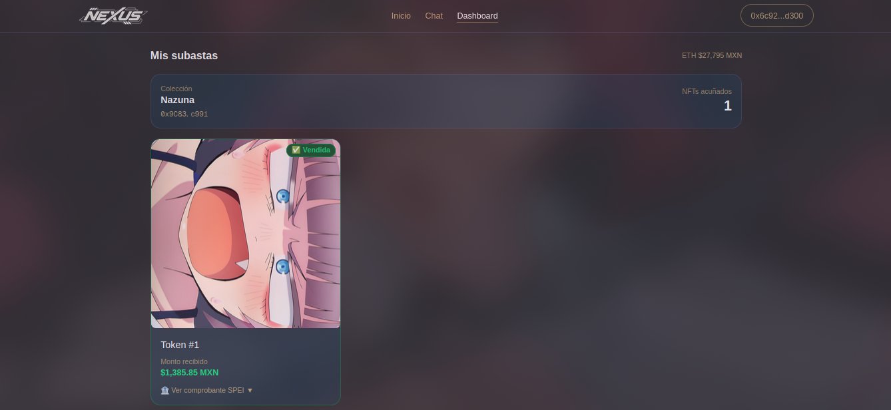
  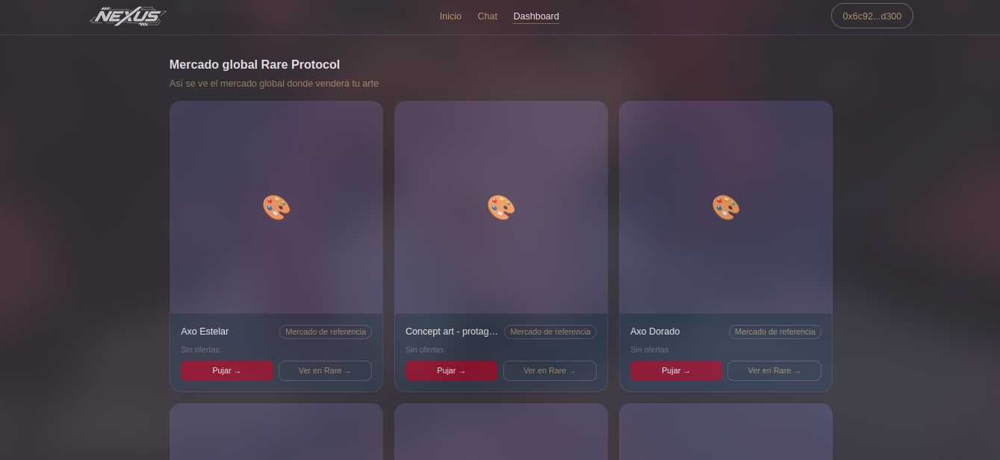
</div>

---

### Flujo de Puja

> Los compradores globales pujan en ETH. El creador recibe pesos mexicanos via SPEI.

<div align="center">
  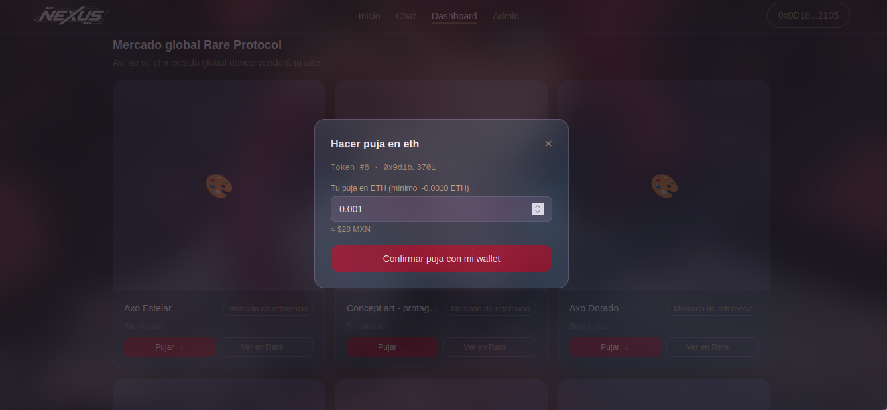
  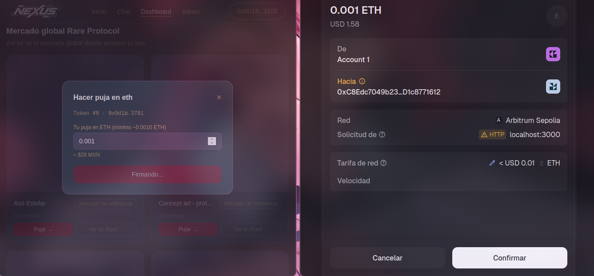
  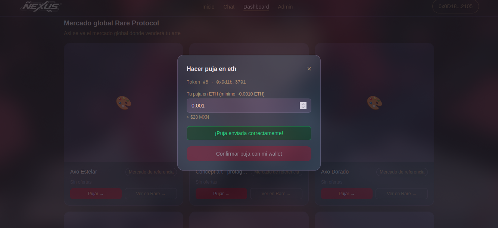
</div>

---

### Admin Panel

> Historial completo de transacciones onchain registradas en NexusRegistry (Sepolia).

<div align="center">
  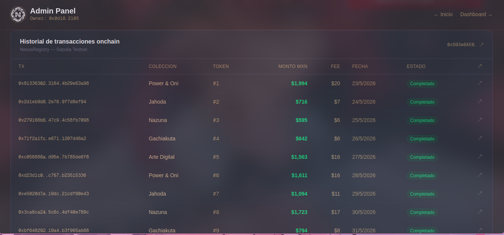
</div>

---

## El Problema

Los creadores digitales en Mexico y LATAM enfrentan una barrera enorme para monetizar su trabajo globalmente:

| Sin NEXUS | Con NEXUS |
|-----------|-----------|
| Necesitas saber Solidity para crear NFTs | Solo hablas en español con el agente |
| Las plataformas solo estan en ingles | Interface 100% en español |
| Western Union cobra hasta **8% de comision** | Menos del **1% de fee** del protocolo |
| Necesitas ETH para pagar el gas | El protocolo paga el gas por ti |
| El pago llega en crypto, no en pesos | Recibes **pesos mexicanos via SPEI** |
| Proceso manual de 6+ plataformas distintas | Un solo chat hace todo automaticamente |

---

## Como Funciona

```
Creador habla en español        NEXUS coordina los agentes       Pesos en su cuenta
        │                                   │                            │
        ▼                                   ▼                            ▼
┌───────────────┐    ┌──────────────────────────────────────┐   ┌──────────────┐
│  "quiero      │───▶│  EMBAJADOR ──▶ CREADOR               │   │   SPEI MXN   │
│   vender mi   │    │      │              │                 │   │  (CLABE 18d) │
│   ilustracion"│    │      │         deploy ERC-721         │   └──────────────┘
└───────────────┘    │      │         mint + IPFS            │          ▲
                     │      │              │                 │          │
                     │      ▼              ▼                 │          │
                     │  MERCADO ◀──── SuperRareBazaar        │          │
                     │      │         analiza precios        │          │
                     │      │         crea subasta 48h       │          │
                     │      │              │                 │          │
                     │      ▼              ▼                 │          │
                     │  TESORERO ◀─── settle_auction         │──────────┘
                     │           ETH → MXN (Bitso)           │
                     │           record_sale (onchain)        │
                     └──────────────────────────────────────┘
```

### El flujo completo en 5 pasos

```
1. Habla (30s)     →  El creador describe lo que quiere crear en español
2. Sube (10s)      →  Adjunta su imagen (JPG / PNG / GIF)
3. Deploy (~2min)  →  El agente despliega ERC-721 + sube metadata a IPFS
4. Subasta (30s)   →  Analiza el mercado y abre subasta de 48h en SuperRare
5. Cobro (2-4h)    →  ETH → MXN via Bitso → SPEI a tu CLABE bancaria
```

---

## Los 4 Agentes de IA

> Cada agente esta especializado en un rol. Juntos gestionan toda la economia digital del creador.

### Agente Embajador `[Interfaz]`
> Tu unico punto de contacto. Habla contigo en español, interpreta tus intenciones y coordina a los demas agentes. Nunca usa jerga tecnica. Impulsado por **Claude AI**.

**Capacidades:**
- Conversacion natural en español (o ingles si el usuario lo prefiere)
- Onboarding guiado para nuevos creadores
- Conversion ETH → MXN en tiempo real en cada mencion de precio
- Coordina el flujo completo de inicio a cobro

---

### Agente Creador `[Blockchain]`
> Especialista en desplegar colecciones y acunar NFTs. Opera en Ethereum Sepolia via **Rare Protocol**.

**Capacidades:**
- Despliega colecciones ERC-721 con un solo comando
- Sube imagenes e metadata a **IPFS via Pinata** automaticamente
- Acuna NFTs con metadata estandar valido
- Retorna contractAddress, tokenIds y txHashes

---

### Agente Mercado `[DeFi]`
> Analista de precios y gestor de subastas en **SuperRareBazaar**.

**Capacidades:**
- Busca NFTs similares para determinar precio optimo
- Precio conservador si < 5 referencias: `floor × 0.9`
- Precio de mercado si >= 5 referencias: promedio de las 3 mas recientes
- Crea y monitorea subastas de 48 horas
- Ejecuta `settle_auction` cuando una subasta termina con oferta

---

### Agente Tesorero `[Pagos]`
> Convierte ETH a pesos y ejecuta el deposito bancario.

**Capacidades:**
- Precio ETH/MXN en tiempo real via **Bitso API**
- Calculo automatico: `grossMXN - 1% fee = creatorMXN`
- Registro de venta onchain en el contrato **NexusRegistry**
- Ejecucion de SPEI a la CLABE bancaria del creador

---

## Tech Stack

| Capa | Tecnologia |
|------|-----------|
| **Frontend** | Next.js 16.2, React 19, TypeScript, Tailwind CSS v4 |
| **AI / Agentes** | Anthropic Claude (SDK `@anthropic-ai/sdk`) |
| **Blockchain** | Viem 2, Wagmi 3, Ethereum Sepolia |
| **NFT Protocol** | Rare Protocol (`@rareprotocol/rare-cli`) |
| **Storage** | IPFS via Pinata |
| **Auth / Wallet** | Privy (`@privy-io/react-auth`) |
| **Pagos** | Bitso Business API (SPEI / ETH → MXN) |
| **Charts** | Recharts |
| **Smart Contract** | NexusRegistry (Solidity, Sepolia) |

---

## Estructura del Proyecto

```
nexus/
├── src/
│   ├── agents/
│   │   ├── index.ts          # Orquestacion de los 4 agentes
│   │   ├── prompts.ts        # System prompts: EMBAJADOR, CREADOR, MERCADO, TESORERO
│   │   ├── tools.ts          # Definicion de herramientas de los agentes
│   │   └── types.ts          # Tipos TypeScript compartidos
│   ├── lib/
│   │   ├── contracts.ts      # NexusRegistry — Viem client + ABI
│   │   ├── bitso.ts          # API de Bitso (ticker ETH/MXN + SPEI)
│   │   ├── rare.ts           # Rare Protocol — deploy + mint + auctions
│   │   └── ipfs.ts           # Pinata — upload de imagenes y metadata
│   └── app/
│       ├── page.tsx          # Landing page con stats y graficas
│       ├── chat/page.tsx     # Interfaz de chat con el Agente Embajador
│       ├── dashboard/page.tsx # Dashboard de ventas del creador
│       ├── admin/page.tsx    # Panel de administracion del protocolo
│       ├── api/
│       │   ├── claude/       # Endpoint del agente conversacional
│       │   ├── bitso/        # Proxy a Bitso API
│       │   ├── rare/         # Proxy a Rare Protocol
│       │   ├── upload/       # Upload a IPFS
│       │   ├── earnings/     # Ganancias del creador desde NexusRegistry
│       │   └── admin/        # Stats y withdraw del protocolo
│       └── _components/
│           ├── Header.tsx
│           ├── Footer.tsx
│           ├── WalletButton.tsx
│           ├── WalletInfo.tsx
│           ├── SPEIReceipt.tsx
│           └── Providers.tsx
└── package.json
```

---

## Instalacion

### Requisitos

- Node.js >= 18
- npm / yarn / pnpm / bun

### Setup

```bash
# 1. Clona el repo
git clone https://github.com/tu-usuario/nexus.git
cd nexus

# 2. Instala dependencias
npm install

# 3. Copia y configura las variables de entorno
cp .env.example .env.local
```

### Variables de Entorno

```env
# ── Anthropic (Claude AI) ───────────────────────────────────────────────────
ANTHROPIC_API_KEY=sk-ant-...

# ── Privy (autenticacion de wallet) ────────────────────────────────────────
NEXT_PUBLIC_PRIVY_APP_ID=...

# ── Bitso Business (ticker ETH/MXN + SPEI) ─────────────────────────────────
BITSO_API_KEY=...
BITSO_API_SECRET=...

# ── Pinata IPFS (upload de imagenes y metadata) ─────────────────────────────
PINATA_JWT=...
PINATA_GATEWAY_URL=https://gateway.pinata.cloud

# ── Ethereum / Smart Contract ───────────────────────────────────────────────
RPC_URL=https://ethereum-sepolia-rpc.publicnode.com
AGENT_PRIVATE_KEY=0x...                      # Clave del agente que firma txs
NEXUS_REGISTRY_ADDRESS=0x...                 # Contrato NexusRegistry en Sepolia

# ── Rare Protocol ───────────────────────────────────────────────────────────
RARE_DEPLOYER_PRIVATE_KEY=0x...
```

> **Nota:** Si `NEXUS_REGISTRY_ADDRESS` no esta configurado o es la zero address, el sistema opera en modo **mock** — perfecto para desarrollo y demos.

### Correr en desarrollo

```bash
npm run dev
```

Abre [http://localhost:3000](http://localhost:3000) en tu browser.

---

## Scripts Disponibles

```bash
npm run dev      # Servidor de desarrollo en localhost:3000
npm run build    # Build de produccion
npm run start    # Inicia el servidor de produccion
npm run lint     # Linter (ESLint)
```

---

## Smart Contract — NexusRegistry

El contrato `NexusRegistry` esta deployado en **Ethereum Sepolia** y actua como registro onchain de todas las ventas del protocolo.

### Funciones principales

```solidity
// Registra una venta (solo agentes autorizados)
function recordSale(address creator, uint256 grossMXNCents, uint256 tokenId) external

// Consulta ganancias totales de un creador (en centavos MXN)
function getCreatorEarnings(address creator) external view returns (uint256)

// Totales del protocolo
function totalSales() external view returns (uint256)
function protocolFees() external view returns (uint256)

// Verifica si una address es agente autorizado
function isAgent(address) external view returns (bool)
```

### Fee del protocolo

```
grossMXN = ethAmount × precioETH/MXN
feeMXN   = grossMXN × 0.01          ← 1% para el protocolo
creatorMXN = grossMXN - feeMXN      ← Lo que recibe el creador
```

---

## El Mercado

```
3.3 M   Creadores digitales en Mexico          (BBVA Research 2024)
12 M    Mexicanos en EE.UU. pagando remesas     (CONAPO 2024)
$49 B   Mercado NFT Global 2025                 (AInvest Research)
30.8%   CAGR NFT en LATAM 2024–2030             (region #1 mundial)

Si el 1% de los creadores digitales de Mexico usara NEXUS:
→ $2.4 M USD en volumen mensual
```

---

## Roadmap

- [x] Agente Embajador — conversacion en español con Claude AI
- [x] Agente Creador — deploy ERC-721 + mint + IPFS via Rare Protocol
- [x] Agente Mercado — subastas en SuperRareBazaar
- [x] Agente Tesorero — ETH → MXN + SPEI via Bitso
- [x] Smart contract NexusRegistry en Sepolia
- [x] Dashboard de ganancias para creadores
- [ ] Soporte para audio / musica como NFT
- [ ] Royalties automaticos en reventas secundarias
- [ ] Expansion a otras redes (Arbitrum, Base)
- [ ] App movil (React Native)
- [ ] Integracion con OXXO Pay para creadores sin cuenta bancaria

---

## Contribuir

Las contribuciones son bienvenidas. Por favor:

1. Haz fork del repo
2. Crea una branch descriptiva: `git checkout -b feature/nombre-feature`
3. Haz commit de tus cambios: `git commit -m 'feat: descripcion del cambio'`
4. Push a tu fork: `git push origin feature/nombre-feature`
5. Abre un Pull Request

---

## Licencia

Este proyecto esta bajo la licencia **MIT**. Ver [LICENSE](./LICENSE) para mas detalles.

---

<div align="center">

Construido con amor en **ETH Mexico 2026**

**Rare Protocol** · **Bitso** · **Ethereum Mexico** · **Anthropic**

</div>
